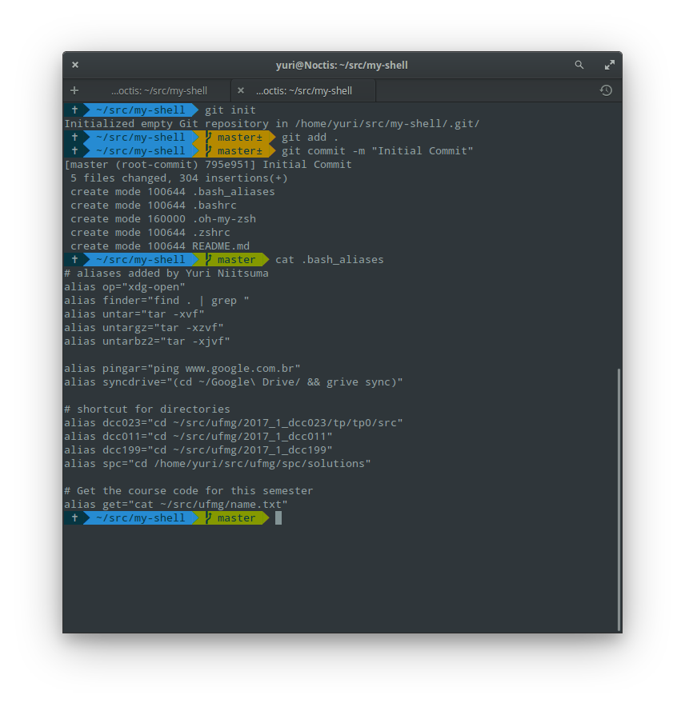

# my-shell

A personal config from oh-my-zsh.



Need:

- [oh-my-zsh](https://github.com/robbyrussell/oh-my-zsh)
- [Powerline fonts](https://github.com/powerline/fonts)
- [Cobalt2 theme](https://github.com/wesbos/Cobalt2-iterm)
- [libinputgesture](https://neal.codes/blog/adding-mac-like-touch-gestures-to-elementary-os)
    add auto-start libinput-gestur

Example:

```
$ gsettings set org.pantheon.terminal.settings font 'Droid Sans Mono for Powerline 10'
```

### Login Bug after some updates

Login slow for 1-2 minutes... seems like probability race condition.
Disable accessibility
```
$ sudo mv /etc/xdg/autostart/at-spi-dbus-bus.desktop /etc/xdg/autostart/at-spi-dbus-bus.disable
```
